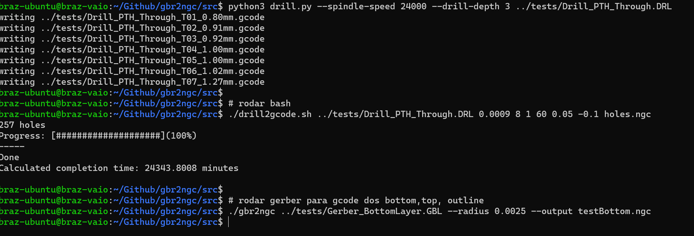

# Imagem de instruções para rodar os scripts diretamente no terminal


> Mudei o nome do bash para drill2ngc.sh

## Rodar binario do gbr2ngc e gere os tres arquivos .ngc (top, bottom e outline)
```sh
./gbr2ngc ../all_files/Gerber_BottomLayer.GBL --radius 0.0025 --output testBottom.ngc
```

```sh
./gbr2ngc ../all_files/Gerber_TopLayer.GTL --radius 0.0025 --output testTop.ngc
```

```sh
./gbr2ngc ../all_files/Gerber_BoardOutlineLayer.GKO --radius 0.0025 --output testOutline.ngc
```

## Para o drill executar o script em python ou rodar o arquivo bash drill2gcode.sh

### Rodar o script em python
```sh
python3 drill.py --spindle-speed 24000 --drill-depth 3 ../all_files/Drill_PTH_Through.DRL
```

```sh
python3 drill.py --spindle-speed 24000 --drill-depth 3 ../all_files/Drill_PTH_Through_Via.DRL
```

### Rodar com o bash
```sh
./drill2ngc.sh ../all_files/Drill_PTH_Through.DRL 0.0009 8 1 60 0.05 -0.1 holes.ngc
```
> Os parametros estão aleatorios e não especificos para o projeto

> Note that this is a linux script, however it can be run on windows via cygwin, provided the 'bc' package is installed Correct usage: drl2ngc <drill file> <diameter of endmill> <lateral feed rate> <vertical feedrate> <rapid movement speed> <rapid movement height> <drill depth> <output file> [fast] Note that all units are in inches or inches/minute, and absolute; ie drill depth is Z value to drill down to) Appending 'fast' to the command will make the script execute faster, however results in a less efficient toolpath, as you can see by comparing the estimated completion times. The fast option is useful for quickly optimizing your parameters and observing the corresponding change in estimated completion time, to achieve an even more efficient toolpath Example usage: ./drl2ngc holes.drl .025 8 1 60 0.05 -0.1 holes.ngc fast


## Link dos repositorios usados
- [Gerber2Gcode](https://github.com/abetusk/gbr2ngc)
- [drill2ngc](https://github.com/DJ027X/drl2ngc)
- [drillpython](https://github.com/jes/drl2gcode)